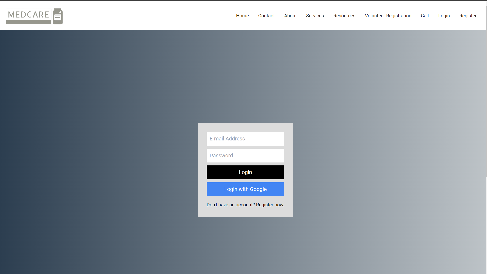
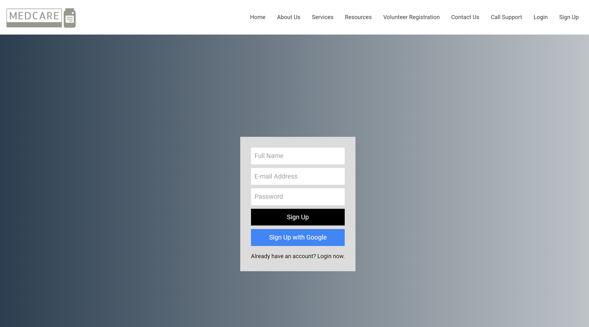
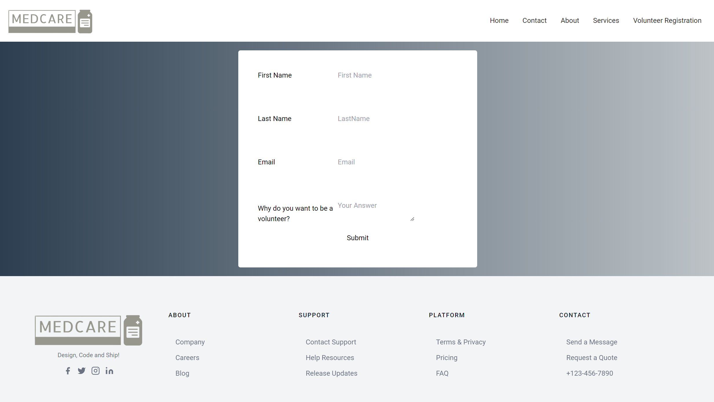
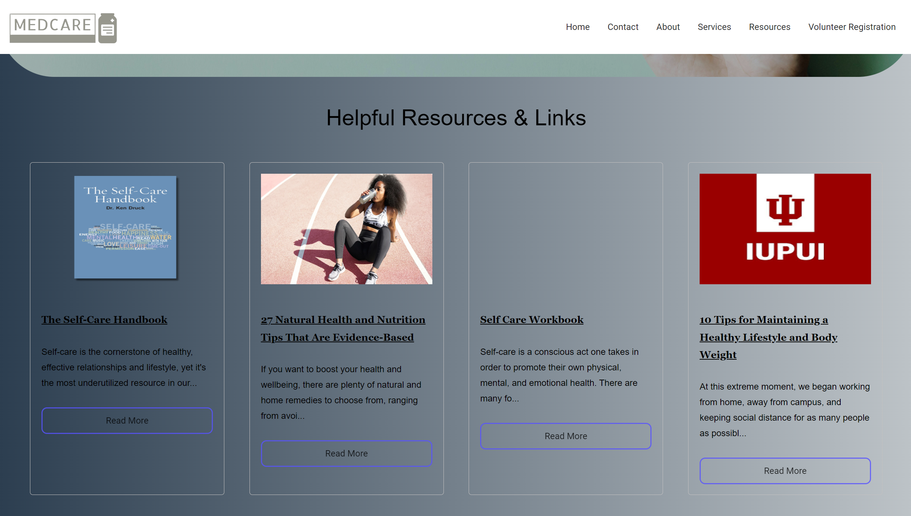
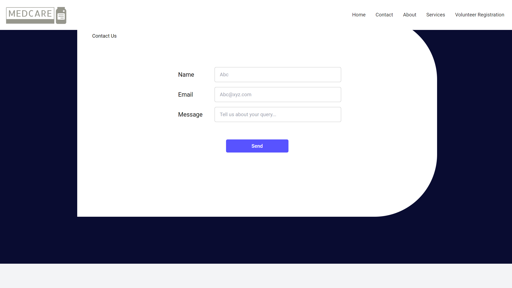

<h1 align="center" > MedCare </h1> 

MedCare is an online platform designed to provide comprehensive healthcare services and resources to users, empowering them to manage their health effectively. Our mission is to make healthcare accessible, informative, and engaging for everyone.

You can also check out the live demo of the website [here](https://project1-one-lovat.vercel.app/).

## Snapshots








## Project Setup

**Clone the project**

```bash
  git clone <https://link-to-project>
```

**Go to the project directory**

```bash
  cd <myProject>
```

**Install dependencies**

```bash
  npm install
```

### Replace the dummy firebase credentials in firebase.js file with your real firebase credentials
```bash
  apiKey: " AIzaSyD-4",
  authDomain: " medcare-72185.firebaseapp.com",
  projectId: "medcare-72185",
  storageBucket: "medcare-72185.appspot.com",
  messagingSenderId: "252642172466",
  appId: "1:252642172465:web:1a4c1b",
  measurementId: "G-4"
```
### You can refer a tutorial on how to get the firebase credentials [here](https://www.youtube.com/watch?v=ZTHdCMj3jP8)

**Start the server**

```bash
  npm start
```

<h3 align="center" > Together, we can make Medcare even more effective in addressing healthcare accessibility challenges worldwide.</h3>

